# DesignGuard v6

DesignGuard is een **Windows-desktopapp** (WPF) voor **security-by-design**: je legt je systeemontwerp vast, de app helpt **dreigingen (STRIDE)**, **security-eisen** en **controls** te genereren, te beheren en te **exporteren**. **v6** gebruikt **MongoDB** als primaire datastore. Er is geen cloud-account in de app zelf nodig; je hebt wel een bereikbare MongoDB nodig waar jij toegang toe geeft.

> De app maakt **geen claim op juridische conformiteit** (AVG, NIS2, CRA, enz.). Export en bron-tags bij eisen zijn **ondersteunend**, geen certificering.

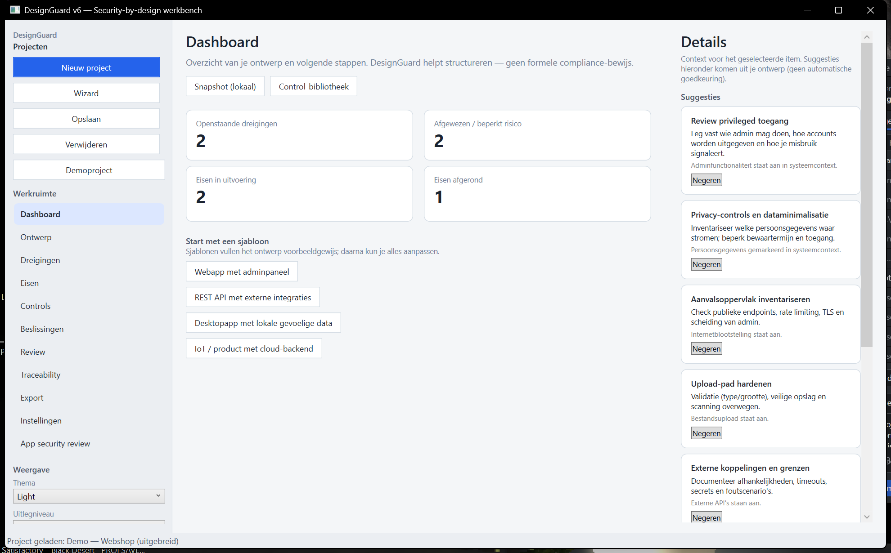

---

## Inhoud

1. [Schermen en screenshots](#schermen-en-screenshots) — o.a. [PNG-index](#png-index)
2. [Tab Ontwerp: van projectnaam tot diagram](#tab-ontwerp-van-projectnaam-tot-diagram)
3. [Overige tabs (dreigingen t/m app-review)](#overige-tabs-dreigingen-tm-app-review)
4. [Demo-project (webshop-scenario)](#demo-project-webshop-scenario)
5. [Waar doe je wat?](#waar-doe-je-wat)
6. [Vereisten](#vereisten)
7. [Configuratie](#configuratie-v6)
8. [Bouwen en starten](#bouwen-en-starten)
9. [Gegevensopslag](#waar-worden-gegevens-opgeslagen)
10. [Eerste gebruik](#eerste-gebruik)
11. [Aanbevolen werkwijze](#aanbevolen-werkwijze)
12. [Technische stack](#technische-stack-kort)
13. [Documentatie](#documentatie)
14. [Screenshots opnieuw maken](#screenshots-opnieuw-maken)

---

## Schermen en screenshots

De interface heeft **drie kolommen** (op elke screenshot hetzelfde patroon):

| Zone | Locatie | Functie |
|------|---------|---------|
| **Projecten** | Links boven | Knoppen: nieuw project, wizard, opslaan, verwijderen, demoproject |
| **Werkruimte** | Links midden | Navigatie naar alle hoofdschermen + **thema**, **uitlegniveau**, **dichtheid** |
| **Projectlijst** | Links onder | Actief project; klik om te wisselen |
| **Hoofdinhoud** | Midden | Het gekozen scherm (formulieren, lijsten, diagram, exportpreview, …) |
| **Details (Inspector)** | Rechts | Suggesties + bewerking van geselecteerde **dreiging**, **eis** of **component** |
| **Statusbalk** | Onder | Status- en foutmeldingen (o.a. MongoDB) |

**Zo lees je de plaatjes:** links staat altijd *waar* je naartoe navigeert; het midden is *het werk*; rechts is *uitleg en bewerking* van je selectie. Onderaan de statusregel zie je o.a. of het project geladen is.

### PNG-index

Gebruik deze tabel om snel de juiste PNG bij een onderwerp te vinden.

| Bestand | Welk scherm (werkruimte) | Kort: waar is het voor |
|---------|--------------------------|-------------------------|
| [01-dashboard.png](docs/screenshots/01-dashboard.png) | **Dashboard** | Startpunt: voortgang, sjablonen, snelle acties. |
| [02a-ontwerp-project-context.png](docs/screenshots/02a-ontwerp-project-context.png) | **Ontwerp** (boven) | Projectnaam, beschrijving, systeemcontext. |
| [02b-ontwerp-boundaries-components.png](docs/screenshots/02b-ontwerp-boundaries-components.png) | **Ontwerp** | Trust boundaries en componenten. |
| [02c-ontwerp-flows-roles-assets.png](docs/screenshots/02c-ontwerp-flows-roles-assets.png) | **Ontwerp** | Datastromen, rollen, assets. |
| [02d-ontwerp-entry-sensitive.png](docs/screenshots/02d-ontwerp-entry-sensitive.png) | **Ontwerp** | Ingangen (entry points) en gevoelige datacategorieën. |
| [02e-ontwerp-diagram.png](docs/screenshots/02e-ontwerp-diagram.png) | **Ontwerp** (onder) | Architectuurdiagram en overlays. |
| [03-dreigingen.png](docs/screenshots/03-dreigingen.png) | **Dreigingen** | STRIDE-dreigingen beheren en analyseren. |
| [04-eisen.png](docs/screenshots/04-eisen.png) | **Eisen** | Security-eisen beheren. |
| [05-controls.png](docs/screenshots/05-controls.png) | **Controls** | Maatregelen (controls) en bibliotheek. |
| [06-beslissingen.png](docs/screenshots/06-beslissingen.png) | **Beslissingen** | Issues, notities, snapshots. |
| [07-review.png](docs/screenshots/07-review.png) | **Review** | Reviewboard met stable id’s. |
| [08-traceability.png](docs/screenshots/08-traceability.png) | **Traceability** | Alleen-lezen trace-overzicht. |
| [09-export.png](docs/screenshots/09-export.png) | **Export** | Rapporten en preview. |
| [10-instellingen.png](docs/screenshots/10-instellingen.png) | **Instellingen** | Knowledge packs en MongoDB. |
| [11-app-security-review.png](docs/screenshots/11-app-security-review.png) | **App security review** | Interne checklist voor de app zelf. |

### Dashboard — `01-dashboard.png`


**Op deze afbeelding:** je bent op **Dashboard** (linkermenu). In het midden zie je **tegels** met tellingen over dreigingen en eisen; daaronder **Snapshot**, **Control-bibliotheek** en **Sjablonen**. Rechts staan **Suggesties** die uit je ontwerp volgen.

| Onderdeel | Wat doe je hier |
|-----------|-----------------|
| **Nieuw project / Wizard / Opslaan / Verwijderen** | Leeg project, wizard met snelle start, alles naar MongoDB schrijven, project verwijderen. |
| **Demoproject** | Zorgt dat het scenario *Demo — Webshop (uitgebreid)* bestaat en verschijnt in de lijst. |
| **Werkruimte (navigatie)** | Kies het scherm: Dashboard, Ontwerp, Dreigingen, enz. |
| **Thema / Uitlegniveau / Dichtheid** | Thema van de UI; **Beginner** toont kortere uitleg in de Inspector, **Advanced** toont o.a. STRIDE-expander volledig; dichtheid bepaalt hoe compact lijsten/kaarten zijn. |
| **Projectlijst onderaan** | Welk project is actief. |
| **Midden: tegels** | Voortgang op dreigingen en eisen (open, gemitigeerd, geïmplementeerd, …). |
| **Snapshot / Control-bibliotheek** | Lokale mijlpaal vastleggen; suggesties uit de control-bibliotheek toepassen (zie tab *Controls*). |
| **Sjablonen** | Vult het ontwerp met een generiek skelet als alternatief op het demoproject. |
| **Rechts: Details** | Suggesties op basis van het ontwerp; bij selectie van dreiging/eis/component verschijnen bewerkvelden. |

---

## Tab Ontwerp: van projectnaam tot diagram

Op **Ontwerp** staat alles onder de titel **Systeemontwerp** op **één lange, scrollbare pagina** in het middenpaneel. In de praktijk werk je van boven naar beneden: eerst **wie/wat** het project is, dan **zones en bouwstenen**, dan **stromen en actoren**, dan **ingangen en data**, tot slot het **diagram**.

De plaatjes **02a**–**02e** tonen diezelfde route: vijf momenten waarop je het middenpaneel naar beneden scrollt. Ze zijn gemaakt met `capture-readme-screenshots.ps1` (UI Automation-scroll op `OntwerpDesignScroll`; instelbaar via `$s02b` / `$s02c` / `$s02d` als je vensterformaat afwijkt).

| Bestand | Wat staat centraal op de screenshot |
|---------|-------------------------------------|
| **02a** | **Project** + **Systeemcontext** (naam, type, deployment, vinkjes). |
| **02b** | **Trust boundaries** + **Componenten** (zones en technische onderdelen). |
| **02c** | **Datastromen** + **Rollen** + **Assets** (pijlen, gebruikers, te beschermen objecten). |
| **02d** | **Ingangen** + **Gevoelige data (categorie)** (expliciete entry points en waar gevoelige categorieën liggen). |
| **02e** | **Architectuurdiagram** (canvas, zoom, overlays, verversen). |

### 1) Project en systeemcontext — `02a`

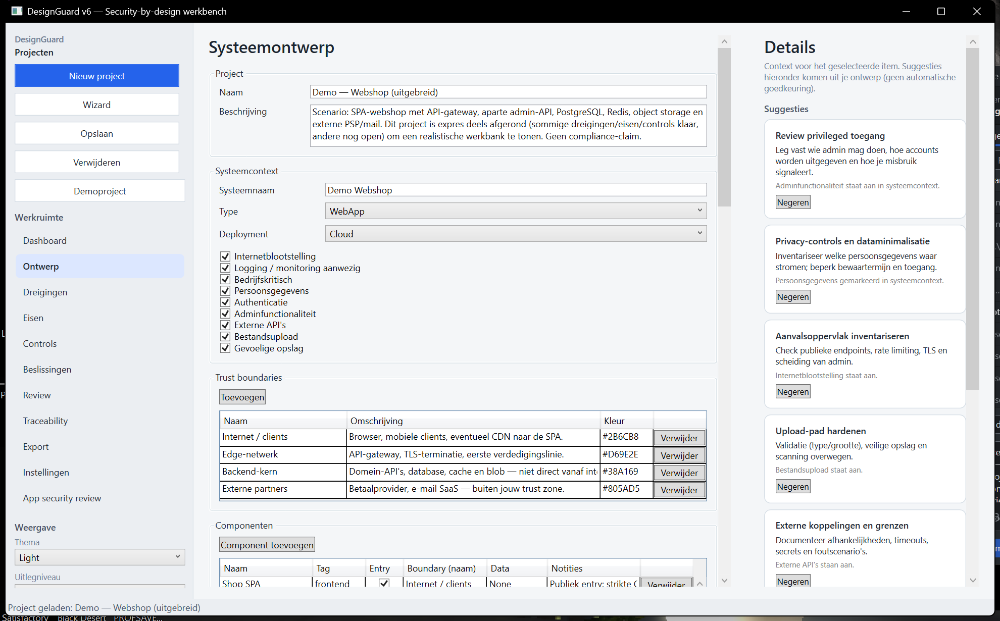

**Op deze afbeelding:** bovenaan tab **Ontwerp**. Hier bepaal je **hoe het project heet**, **waar het over gaat** en **in welke context** het systeem draait (type, deployment, risico-vinkjes). Dat voedt later de automatische dreigingen en de teksten in de Inspector.

**Typische acties:** project aanmaken of openen → **Ontwerp** → naam en beschrijving invullen → systeemnaam en context kiezen → vinkjes zetten die echt op jouw scope van toepassing zijn.

| Blok / veld | Gedetailleerde uitleg |
|-------------|----------------------|
| **Project — Naam** | De naam van je security-by-design-werkmap in DesignGuard. Gebruik iets dat je team herkent (product, release, omgeving). Dit is niet automatisch de systeemnaam; die staat apart onder *Systeemcontext*. |
| **Project — Beschrijving** | Vrije tekst: scope, stakeholders, link naar architectuurdocument, enz. Helpt bij export en review. |
| **Systeemcontext — Systeemnaam** | De naam van het **IT-systeem** of product dat je modelleert (kan gelijk zijn aan de projectnaam, maar hoeft niet). |
| **Systeemcontext — Type** | Combo: soort systeem (bijv. webapp, API-only). Dit stuurt samen met de vinkjes welke regels en dreigingssuggesties logisch zijn. |
| **Systeemcontext — Deployment** | Waar draait het (cloud, on-prem, hybride, …). Beïnvloedt o.a. verwachtingen rond netwerk en trust zones. |
| **Vinkjes** (Internetblootstelling t/m Gevoelige opslag) | Snelle scope: **Internetblootstelling**, **Logging/monitoring**, **Bedrijfskritisch**, **Persoonsgegevens**, **Authenticatie**, **Adminfunctionaliteit**, **Externe API's**, **Bestandsupload**, **Gevoelige opslag**. Deze vlaggen voeden triggers voor gegenereerde dreigingen/eisen en teksten in de Inspector. |

### 2) Trust boundaries en componenten — `02b`

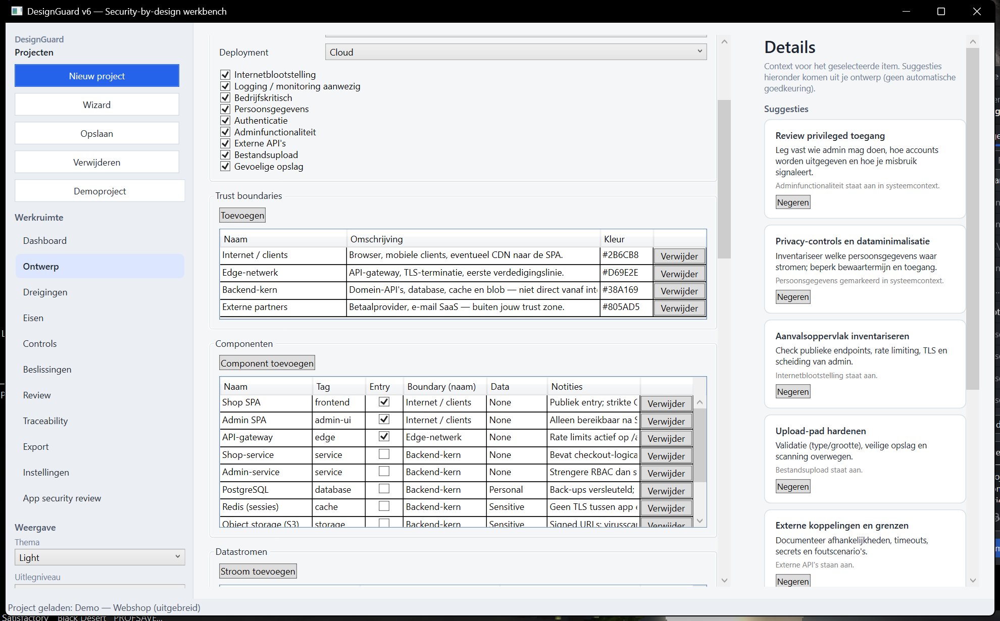

**Op deze afbeelding:** je bent verder naar beneden gescrolld op **Ontwerp**. Centraal staan **trust boundaries** (vertrouwenszones) en het **componentenraster**: dat is je “bouwplaat” voor het diagram. Kolom **Entry** en **Boundary** bepalen mee hoe het aanvalsoppervlak en de zones in het diagram worden geïnterpreteerd.

**Typische acties:** zones definiëren die bij jullie architectuur horen → per component een **naam**, **tag**, **boundary** en zo nodig **Entry** en **Data**-gevoeligheid invullen → ontbrekende services of datastores toevoegen met **Component toevoegen**.

| Blok / kolom | Gedetailleerde uitleg |
|--------------|----------------------|
| **Trust boundaries — Toevoegen** | Maakt een nieuwe vertrouwensgrens. Een grens scheidt omgevingen met **verschillend vertrouwensniveau** (internet vs. intern netwerk, DMZ vs. data-laag). |
| **Trust boundaries — Naam** | Korte id voor de zone (bijv. `Internet`, `Backend`). Componenten koppelen hieraan via **Boundary (naam)**. |
| **Trust boundaries — Omschrijving** | Wat hoort in deze zone, welke aannames. |
| **Trust boundaries — Kleur** | Hint voor het diagram (weergave / overlay). |
| **Trust boundaries — Verwijder** | Verwijdert de grens; controleer eerst dat geen componenten meer naar deze naam verwijzen. |
| **Componenten — Component toevoegen** | Nieuwe bouwsteen (service, DB, SPA, externe SaaS, …). |
| **Componenten — Naam** | Weergavenaam in lijst en diagram. |
| **Componenten — Tag** | Korte technische tag (bijv. `api`, `db`) voor overzicht en export. |
| **Componenten — Entry** | Vinkje: dit component is een **publieke of primaire ingang** van buitenaf (first line of contact). Samen met *Ingangen* documenteer je het aanvalsoppervlak. |
| **Componenten — Boundary (naam)** | Moet overeenkomen met een **Trust boundary — Naam** zodat het diagram zones kan kleuren/groeperen. |
| **Componenten — Data** | Gevoeligheid van data die dit component verwerkt (bijv. hoog/medium; vrije tekst). Drijft suggesties en diagramstijl. |
| **Componenten — Notities** | Implementatie-details, tech stack, URL-patronen. |
| **Componenten — Verwijder** | Verwijdert de bouwsteen; pas datastromen aan die ernaar verwezen. |

Klik een componentrij om in de **Inspector** component-specifieke context en suggesties te zien.

### 3) Datastromen, rollen en assets — `02c`

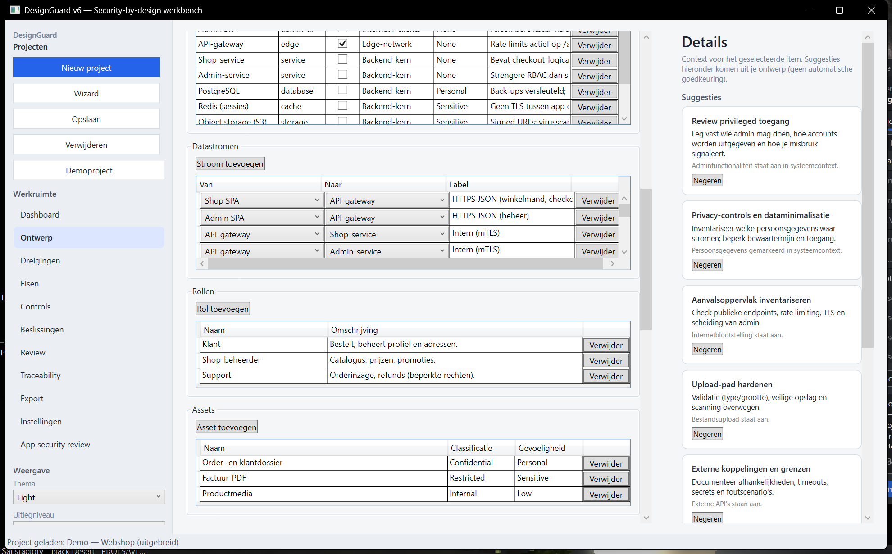

**Op deze afbeelding:** het **verbindingsdiagram** in tekstvorm (**Datastromen**: van welk component naar welk component, met welk kanaal), wie het systeem gebruikt (**Rollen**), en welke **assets** je expliciet beschermt. Dit drijft STRIDE-discussies (bijv. afluisteren op een stroom, misbruik van een rol) en vult het diagram met pijlen.

**Typische acties:** voor elke relevante verbinding **Stroom toevoegen** → **Van** / **Naar** uit de componentenlijst → **Label** (protocol of kanaal) → rollen en assets aanvullen zodat eisen en review niet “los” hangen.

| Blok | Gedetailleerde uitleg |
|------|----------------------|
| **Datastromen — Stroom toevoegen** | Definieert gerichte communicatie **Van** → **Naar** tussen twee componenten uit de componentenlijst. |
| **Datastromen — Van / Naar** | Bron- en doelcomponent. Zonder stromen is het diagram een losse verzameling dozen. |
| **Datastromen — Label** | Kanaal of protocol (HTTPS, gRPC, message queue, batch, …). Nuttig voor STRIDE (bijv. tampering op het kanaal). |
| **Datastromen — Verwijder** | Verwijdert deze pijl uit model en diagram. |
| **Rollen — Rol toevoegen** | Gebruikers of actoren (klant, admin, partner). |
| **Rollen — Naam / Omschrijving** | Wie doet wat; ondersteunt misuse cases en autorisatie-eisen. |
| **Rollen — Verwijder** | Verwijdert de rol. |
| **Assets — Asset toevoegen** | Business-object dat je beschermt (order, factuur, sessie, …). |
| **Assets — Naam** | Naam van het asset. |
| **Assets — Classificatie** | Bijv. intern, vertrouwelijk (vrije tekst of conventie van je org). |
| **Assets — Gevoeligheid** | Impact bij lek (bijv. PII, financieel). |
| **Assets — Verwijder** | Verwijdert het asset. |

### 4) Ingangen en gevoelige datacategorieën — `02d`

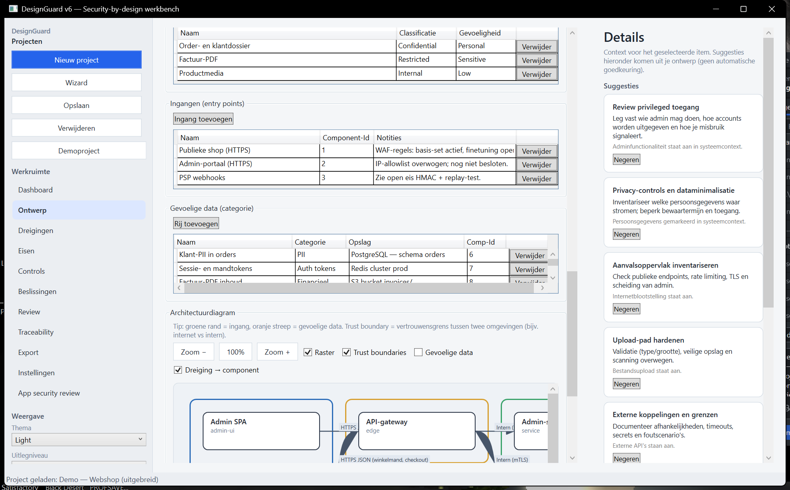

**Op deze afbeelding:** expliciete **ingangen** (URL’s, admin-portaal, webhooks, …) naast het vinkje **Entry** op componenten, en een aparte tabel **Gevoelige data (categorie)** die beschrijft **welke soort data waar** ligt (opslag + component). Dat helpt bij pentest-scope, privacy en het aanzetten van diagram-overlays.

**Typische acties:** elke publiek bereikbare route vastleggen onder **Ingangen** → koppelen aan **Component-Id** waar dat kan → per gevoelige categorie **Opslag** en **Comp-Id** invullen zodat export en diagram kloppen.

| Blok | Gedetailleerde uitleg |
|------|----------------------|
| **Ingangen — Ingang toevoegen** | Expliciet **toegangspad**: URL-prefix, webhook, admin-console, mobiele deep link, … Aanvulling op het vinkje **Entry** bij componenten; handig voor pentest-scope en review. |
| **Ingangen — Naam** | Herkenbare naam van de ingang. |
| **Ingangen — Component-Id** | Koppelt aan het juiste component (id zoals in je model / export). |
| **Ingangen — Notities** | Auth-scheme, rate limits, IP-filters, enz. |
| **Ingangen — Verwijder** | Verwijdert de rij. |
| **Gevoelige data (categorie) — Rij toevoegen** | Welke **soort** gevoelige data **waar** zit (los van één asset-rij). |
| **Gevoelige data — Naam** | Bijv. “Klantprofiel”, “Betaaltoken”. |
| **Gevoelige data — Categorie** | Bijv. PII, credentials, financieel. |
| **Gevoelige data — Opslag** | Database, bucket, cache, logbestand, … |
| **Gevoelige data — Comp-Id** | Welk component deze data primair beheert. |
| **Gevoelige data — Verwijder** | Verwijdert de rij. Dit beïnvloedt o.a. diagram-overlay **Gevoelige data**. |

### 5) Architectuurdiagram — `02e`

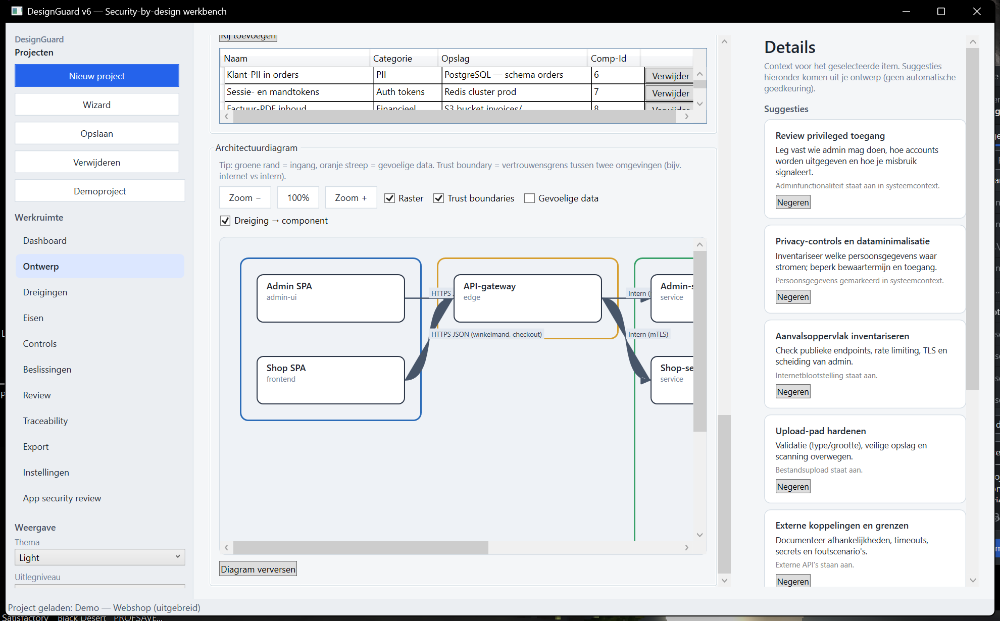

**Op deze afbeelding:** het **visuele model** van componenten en datastromen, met knoppen voor zoom en vinkjes voor **trust boundaries**, **gevoelige data** en **dreiging → component**. Onderaan (of nabij het diagram) gebruik je **Diagram verversen** als je tabellen hebt gewijzigd en het beeld moet meelopen.

**Typische acties:** overlays aan- en uitzetten om een review of screenshot voor te bereiden → zoomen voor leesbaarheid → na wijzigingen in componenten/stromen **Diagram verversen** → daarna op **Dreigingen** / **Eisen** desgewenst **Analyse vernieuwen**.

| Onderdeel | Gedetailleerde uitleg |
|-----------|----------------------|
| **Zoom − / 100% / Zoom +** | Schaalt het canvas; **100%** past vaak het diagram in het venster. |
| **Raster** | Achtergrondraster voor uitlijning (presentatie). |
| **Trust boundaries** | Tekent zones rond componenten op basis van boundary-namen. |
| **Gevoelige data** | Markeert componenten gekoppeld aan gevoelige data (visuele nadruk). |
| **Dreiging → component** | Toont koppelingen van dreigingen naar componenten (na analyse). |
| **Diagram verversen** | Herberekent layout/edges uit het actuele ontwerp (componenten + datastromen). Gebruik dit na grotere wijzigingen in tabellen. |
| **Canvas** | Nodes = componenten, pijlen = datastromen. **Groene rand** markeert entry-componenten; overlays volgen de vinkjes hierboven. |

**Tip:** Na grote wijzigingen op *Ontwerp*: eerst **Diagram verversen**, daarna op *Dreigingen* / *Eisen* **Analyse vernieuwen** zodat lijsten en dreigingskoppelingen synchroon blijven.

---

## Overige tabs (dreigingen t/m app-review)

Hieronder: per tab één README-plaatje. Navigatie: klik in de **werkruimte** links op de tabnaam; het midden toont de lijst of het formulier; rechts de **Inspector** voor de geselecteerde regel (behalve **Traceability** en gedeeltelijk **Export**, waar het midden anders is ingericht).

### Dreigingen — `03-dreigingen.png`

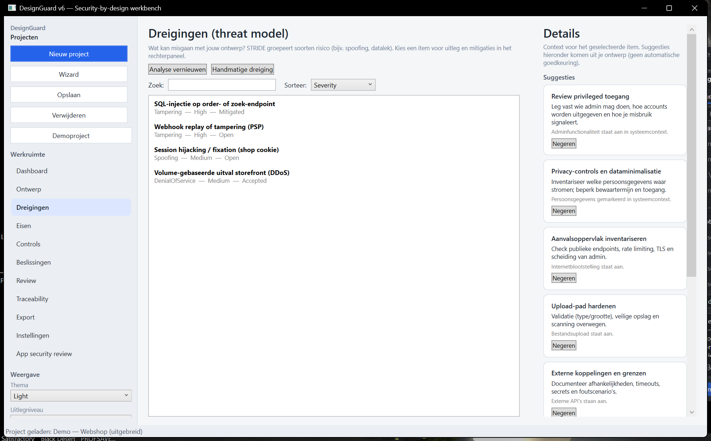

**Op deze afbeelding:** tab **Dreigingen**. Je ziet knoppen **Analyse vernieuwen** en **Handmatige dreiging**, een sorteervoorkeuze, en een **lijst met dreigingen**. Rechts kun je een dreiging openklappen en bewerken zodra je er een selecteert.

**Waarvoor:** dreigingen (STRIDE) beheren die uit het ontwerp komen of handmatig zijn toegevoegd; status en teksten bijwerken; mitigaties en bron-tags vastleggen.

| Onderdeel | Uitleg |
|-----------|--------|
| **Analyse vernieuwen** | Genereert/verfrist dreigingen op basis van het ontwerp. Items met **Behoud bij opnieuw genereren** / `UserModified` in de Inspector worden beschermd waar van toepassing. |
| **Handmatige dreiging** | Voegt een eigen dreiging toe buiten de generator om. |
| **Sorteer-combo** | Sorteer op o.a. Severity, Status, Category. |
| **Lijst midden** | Alle dreigingen met titel en kernmetadata; klik voor Inspector. |
| **Inspector** | Titel, beschrijving, notities, STRIDE, ernst, status, triggers, mitigaties, bron-tags, vinkje handmatig behouden. |

### Eisen — `04-eisen.png`

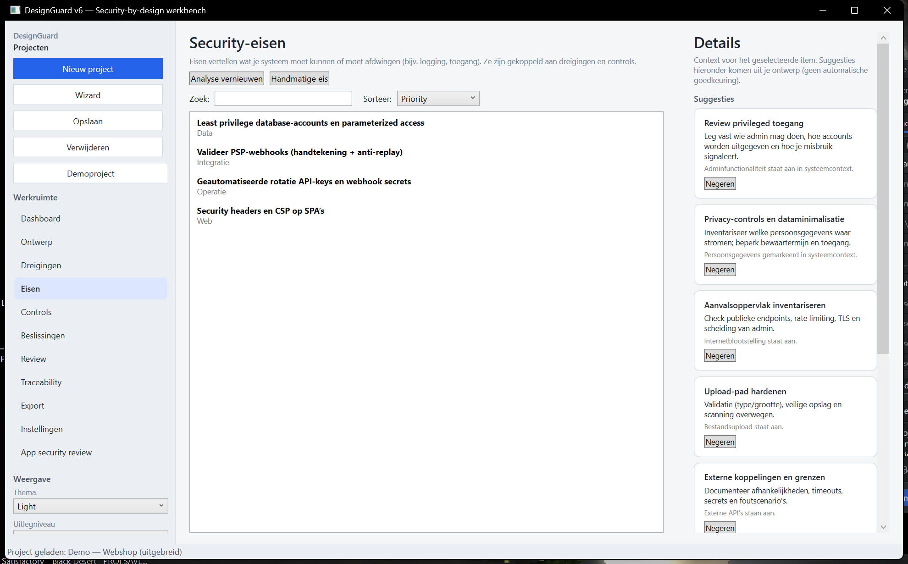

**Op deze afbeelding:** tab **Eisen**, zelfde lay-out als dreigingen: **Analyse vernieuwen**, **Handmatige eis**, sortering, lijst midden, details rechts.

**Waarvoor:** security-eisen formuleren en prioriteren; koppelen aan dreigingen; status volgen (bijv. geaccepteerd, geïmplementeerd).

| Onderdeel | Uitleg |
|-----------|--------|
| **Analyse vernieuwen** | Zelfde ontwerp-engine als bij dreigingen; houdt eisen synchroon met het model. |
| **Handmatige eis** | Eigen eis toevoegen. |
| **Sorteer-combo** | O.a. Priority, Status, Category. |
| **Lijst + Inspector** | Bewerk teksten, prioriteit, status, koppelingen aan dreigingen; bronverwijzingen voor audit trail. |

### Controls — `05-controls.png`

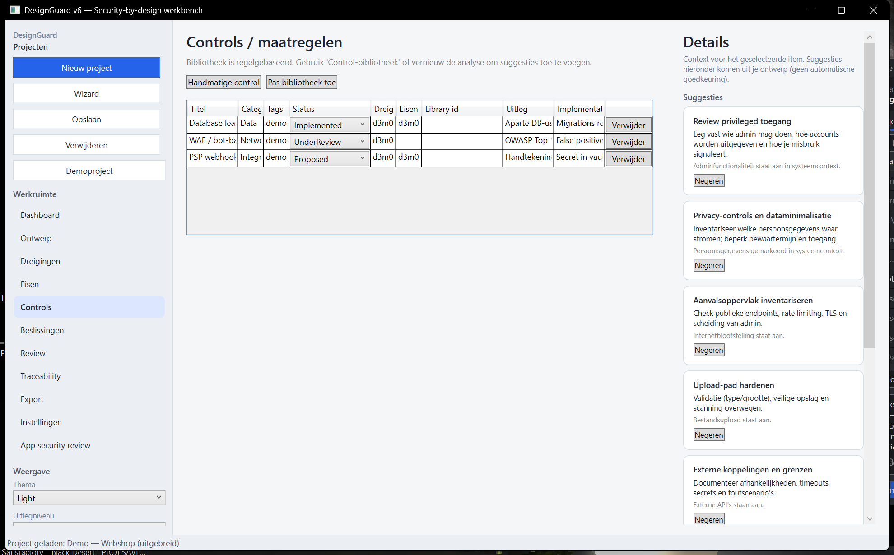

**Op deze afbeelding:** tab **Controls** met een **tabel van maatregelen** (titel, categorie, status, koppelingen aan dreiging/eis via stable id’s, bibliotheek-id, uitleg). Knoppen voor handmatige control en **Pas bibliotheek toe**.

**Waarvoor:** concrete controls vastleggen die dreigingen mitigeren of eisen invullen; bibliotheekregels toepassen voor consistentie.

| Onderdeel | Uitleg |
|-----------|--------|
| **Handmatige control** | Nieuwe maatregel vastleggen. |
| **Pas bibliotheek toe** | Trekt voorgedefinieerde controls binnen en koppelt waar mogelijk aan dreigingen/eisen. |
| **Tabel** | Titel, categorie, tags, status (levenscyclus), gekoppelde stable id’s van dreiging/eisen, library-id, uitleg, implementatierichting. **Verwijder** per rij. |

### Beslissingen — `06-beslissingen.png`

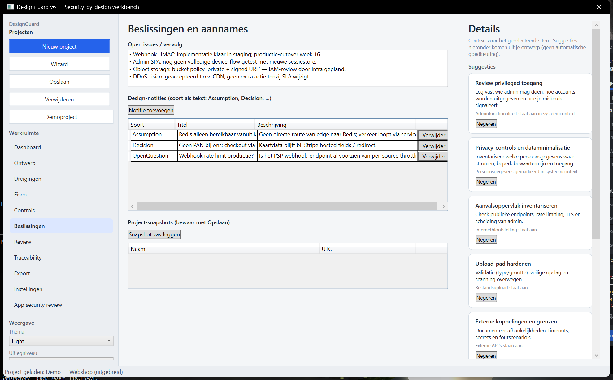

**Op deze afbeelding:** tab **Beslissingen** met vrije tekst **Open issues**, tabel **Design-notities**, en **Snapshots** van het ontwerp op een tijdstip.

**Waarvoor:** besluiten en aannames vastleggen; backlog van open punten; interne mijlpalen bewaren (vergeet niet **Opslaan** naar MongoDB).

| Onderdeel | Uitleg |
|-----------|--------|
| **Open issues / vervolg** | Vrije tekst: backlog, vragen, acties. |
| **Design-notities** | Gestuctureerde notities (soort, titel, beschrijving): aannames, besluiten, constraints. |
| **Snapshot vastleggen** | Slaat een benoemde mijlpaal op in het project (met **Opslaan** naar MongoDB). |
| **Snapshots-tabel** | Naam, tijdstip (UTC), verwijderen. |

### Review — `07-review.png`

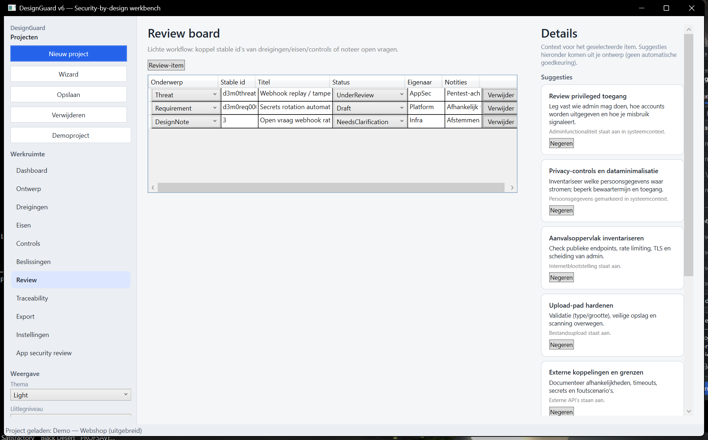

**Op deze afbeelding:** tab **Review** met een **reviewboard**: onderwerp (type), stable id, titel, status, eigenaar, notities.

**Waarvoor:** lichte workflow rond “wie reviewt welk item” zonder de dreigings- of eisenlijst zelf te vervangen.

| Onderdeel | Uitleg |
|-----------|--------|
| **Review-item** | Nieuwe regel op het board. |
| **Onderwerp** | Type: dreiging, eis, control, notitie, … |
| **Stable id** | Verwijst naar het object in andere tabs (traceerbaar in export). |
| **Titel / Status / Eigenaar / Notities** | Lichte workflow: wie pakt wat op, welke status (review, concept, …). |

### Traceability — `08-traceability.png`

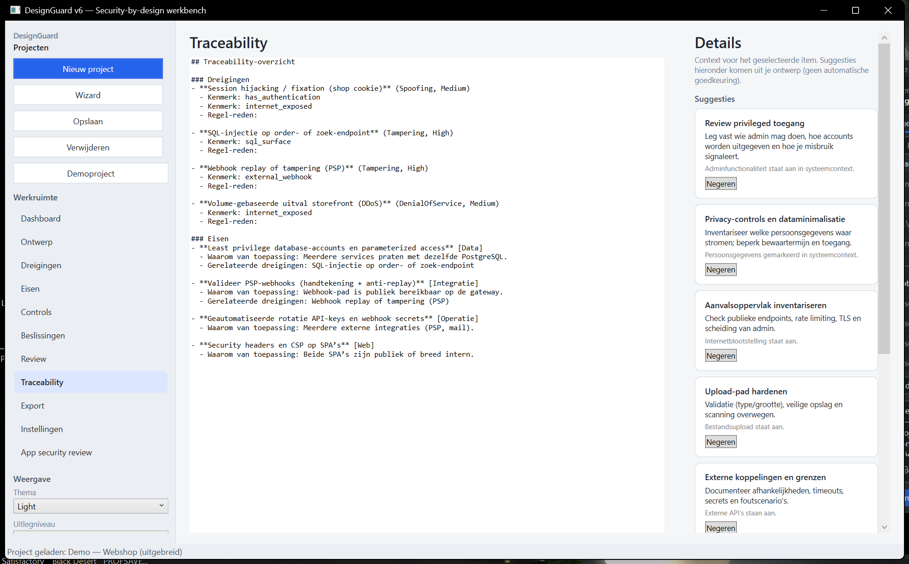

**Op deze afbeelding:** tab **Traceability** met één groot **alleen-lezen** tekstveld (vaak monospace): een gegenereerd overzicht van relaties en id’s.

**Waarvoor:** snel kopiëren naar een document of auditor; niet bewerken—wijzig brondata in de andere tabs.

| Onderdeel | Uitleg |
|-----------|--------|
| **Tekstveld (alleen-lezen)** | Gegenereerde **traceability-tekst**: relaties tussen items (review, documentatie, stable id’s). Gebruik dit om te delen met auditors of om te plakken in een DMS. Je bewerkt hier niets; wijzigingen doe je in de bron-tabs. |

### Export — `09-export.png`

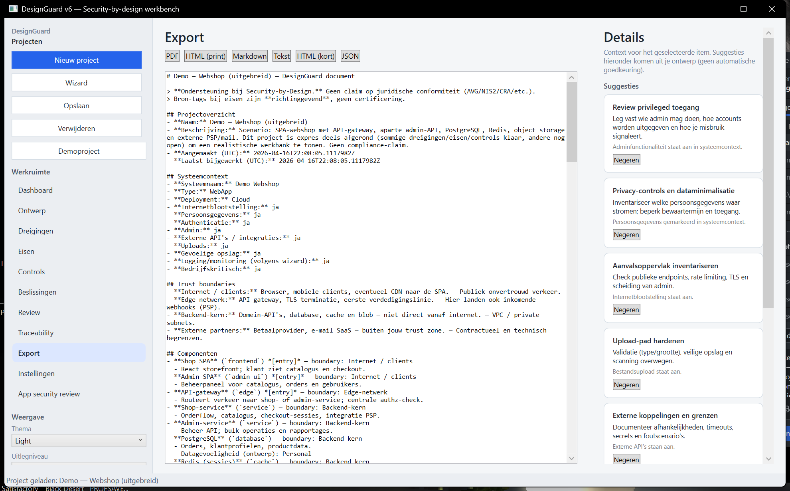

**Op deze afbeelding:** tab **Export** met knoppen per formaat (PDF, HTML, Markdown, …) en een **preview** van de gegenereerde inhoud onderaan of ernaast in het middenpaneel.

**Waarvoor:** rapport of dataset uit het huidige project genereren en controleren voordat je het deelt.

| Onderdeel | Uitleg |
|-----------|--------|
| **Knoppen** | **PDF**, **HTML (print)**, **Markdown**, **Tekst**, **HTML (kort)**, **JSON** (en eventuele andere exportknoppen in jouw build). |
| **Preview** | Toont het resultaat in het venster voordat je bestanden deelt. Controleer hier gevoelige data voordat je extern verstuurt. |

### Instellingen — `10-instellingen.png`

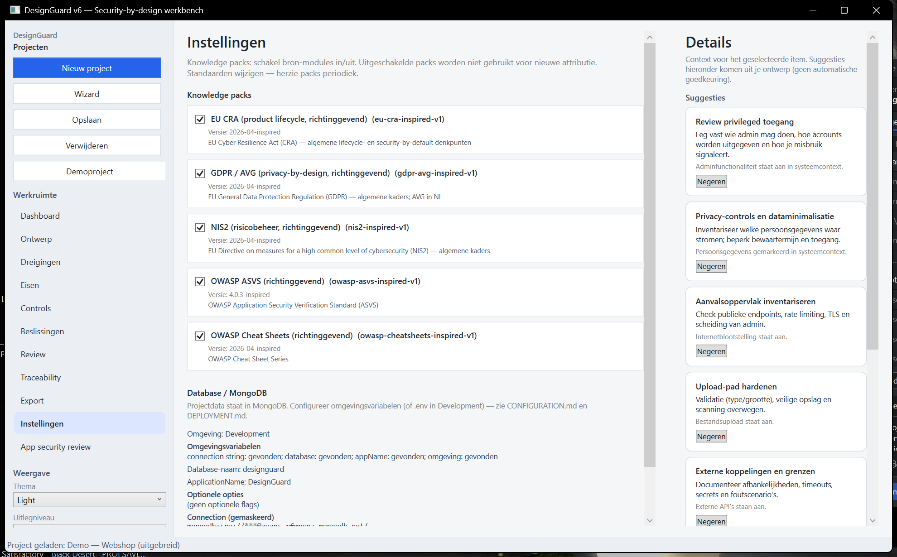

**Op deze afbeelding:** tab **Instellingen** met **Knowledge packs** (aan/uit, versie, bron) en het blok **Database / MongoDB** (diagnose, gemaskeerde connection string, ping).

**Waarvoor:** bepalen welke kennisbronnen voor attributie worden gebruikt; databaseconfiguratie controleren; optioneel SQLite-import starten.

| Onderdeel | Uitleg |
|-----------|--------|
| **Knowledge packs** | Per pack: aan/uit, versie, bron, waarschuwing als pack verouderd is. Uitgeschakelde packs worden niet gebruikt voor **nieuwe** attributie. |
| **Database / MongoDB** | Diagnose: omgeving, env-vars (overzicht), database-naam, application name, opties, gemaskeerde connection string, waarschuwingen, ping-resultaat. |
| **Verbinding testen (ping)** | Controleert bereikbaarheid met huidige configuratie. |
| **Importeer SQLite → MongoDB** | Migratie vanaf oude v4-database; zie [DEPLOYMENT.md](DEPLOYMENT.md). |

### App security review — `11-app-security-review.png`

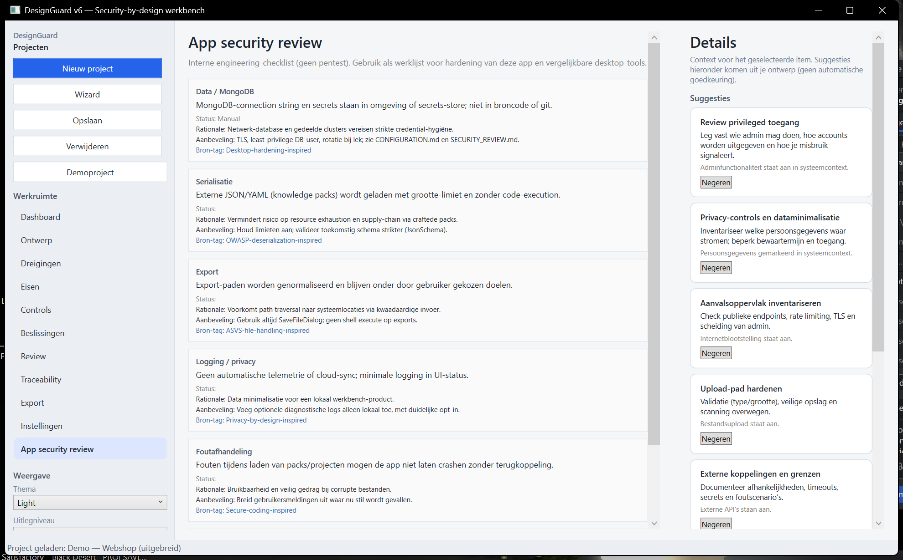

**Op deze afbeelding:** tab **App security review** met een lijst **checklistregels** (domein, formulering, status, rationale, aanbeveling, bron-tag). Dit gaat over **DesignGuard als product**, niet over jouw gemodelleerde webshop.

**Waarvoor:** interne hardening-werklijst voor desktop/LOB-achtige apps; geen vervanging van een pentest.

| Onderdeel | Uitleg |
|-----------|--------|
| **Doel** | **Geen** vervanging van een pentest. Het is een **interne checklist** voor hardening van DesignGuard zelf en vergelijkbare desktop-tools. |
| **Per regel** | **Domein**, **itemtekst**, **Status**, **Rationale**, **Aanbeveling**, **Bron-tag**. Gebruik het als werklijst voor je eigen ontwikkelproces. |

---

## Demo-project (webshop-scenario)

Het ingebouwde project **Demo — Webshop (uitgebreid)** (constant in code: `DemoProjectFactory.DemoProjectDisplayName`) is een **fictief** webshop-scenario met:

- **Meerdere trust zones** (internet, edge, backend, partners).
- **Meerdere componenten** (SPA’s, gateway, services, PostgreSQL, Redis, object storage, PSP, mail).
- **Datastromen** tussen de relevante paren.
- **Rollen, assets, entry points** en **gevoelige datacategorieën** zodat de tab *Ontwerp* op meerdere schermhoogtes uitleg heeft.
- **Dreigingen, eisen, controls en review-items** in gemengde status (alsof er al in is gewerkt).

Het demoproject wordt bij eerste start aangemaakt als MongoDB bereikbaar is. Oudere demo’s met andere namen blijven staan tot je ze opruimt.

---

## Waar doe je wat?

Zie ook de **[PNG-index](#png-index)** voor de koppeling naar elke PNG.

| Taak | Waar in de app | Voorbeeld in README |
|------|----------------|---------------------|
| Nieuw project starten | Links: **Nieuw project** of **Wizard** | `01` (Dashboard-knoppen) |
| Project kiezen | Links onder: **projectlijst** | alle screenshots (linksonder) |
| Alles naar MongoDB wegschrijven | Links: **Opslaan** | `01` |
| Projectnaam en -beschrijving | **Ontwerp** → groep **Project** | `02a` |
| Systeemcontext en scope-vinkjes | **Ontwerp** → **Systeemcontext** | `02a` |
| Trust zones | **Ontwerp** → **Trust boundaries** | `02b` |
| Bouwstenen en entry-vlag | **Ontwerp** → **Componenten** | `02b` |
| Datastromen voor diagram | **Ontwerp** → **Datastromen** | `02c` |
| Actoren | **Ontwerp** → **Rollen** | `02c` |
| Te beschermen objecten | **Ontwerp** → **Assets** | `02c` |
| URL’s / webhooks documenteren | **Ontwerp** → **Ingangen (entry points)** | `02d` |
| Gevoelige datatypes per opslag | **Ontwerp** → **Gevoelige data (categorie)** | `02d` |
| Diagram bekijken en overlays | **Ontwerp** → **Architectuurdiagram** | `02e` |
| Dreigingen/eisen herberekenen | **Dreigingen** / **Eisen**: **Analyse vernieuwen** | `03` / `04` |
| STRIDE en status van één dreiging | Dreiging selecteren → **Inspector** | `03` |
| Handmatige inhoud behouden | Inspector: **Behoud bij opnieuw genereren** | `03` / `04` |
| Controls | **Controls**; op Dashboard: **Control-bibliotheek** | `05` |
| Open punten en besluiten | **Beslissingen** | `06` |
| Review-workflow | **Review** | `07` |
| Trace-overzicht alleen-lezen | **Traceability** | `08` |
| Rapport / bestand | **Export** | `09` |
| Packs en database | **Instellingen** | `10` |
| Checklist voor de app zelf | **App security review** | `11` |
| Thema en uitleg-diepte | **Thema**, **Uitlegniveau**, **Dichtheid** | linkerkolom op alle tabs |

---

## Vereisten

- **Windows** (WPF)
- [.NET 10 SDK](https://dotnet.microsoft.com/download) (komt overeen met `TargetFramework` in het project)
- **MongoDB** (lokaal, Docker, eigen server of Atlas) — zie [DEPLOYMENT.md](DEPLOYMENT.md)

```powershell
dotnet --version
```

---

## Configuratie (v6)

Stel minimaal deze **omgevingsvariabelen** in (of gebruik een `.env` in development — zie [CONFIGURATION.md](CONFIGURATION.md)):

```text
DESIGNGUARD_MONGODB_CONNECTION_STRING=mongodb://localhost:27017
DESIGNGUARD_MONGODB_DATABASE=designguard
DESIGNGUARD_MONGODB_APPNAME=DesignGuard
DESIGNGUARD_ENVIRONMENT=Development
```

Sjabloon zonder secrets: [.env.example](.env.example).

---

## Bouwen en starten

Vanuit de map waar `DesignGuard.sln` staat:

```powershell
dotnet build
dotnet run --project DesignGuard\DesignGuard.csproj
```

Of open `DesignGuard.sln` in Visual Studio en start met **F5**.

Zorg dat MongoDB draait en bereikbaar is voordat je projecten opslaat.

---

## Waar worden gegevens opgeslagen?

- **Projecten en ontwerpdata:** MongoDB-database (configureerbaar via env).
- **Lokale voorkeuren:** `%LOCALAPPDATA%\DesignGuard\user-settings.json` (o.a. knowledge pack toggles, exportmap, thema).
- **Knowledge packs:** JSON onder `KnowledgePacks\` naast de executable.
- **Back-up:** gebruik MongoDB-backups (`mongodump`, Atlas, enz.) en kopieer indien nodig de LocalAppData-map voor instellingen.

### Migratie vanaf SQLite (v4)

In de app: **Instellingen → Importeer SQLite → MongoDB** en selecteer het oude `.db`-bestand. Zie [DEPLOYMENT.md](DEPLOYMENT.md).

---

## Eerste gebruik

1. Configureer MongoDB (env of `.env` in Development).
2. Start de app; bij ontbrekende config zie je een waarschuwing op **Instellingen** en in de **statusbalk**.
3. Gebruik **Verbinding testen (ping)** op Instellingen.
4. Gebruik **Demoproject** of wacht tot het demoproject in de lijst staat; selecteer het om de screenshots uit deze README na te lopen.

---

## Aanbevolen werkwijze

1. **Project aanmaken** — **Nieuw project** of **Wizard**; geef een duidelijke **naam** en **beschrijving**.
2. **Systeemcontext** — Vul **systeemnaam**, **type**, **deployment** en zet de **vinkjes** die kloppen voor jouw scope.
3. **Trust boundaries** — Definieer zones voordat je componenten plant.
4. **Componenten** — Alle bouwstenen; markeer **Entry** en **Data**-gevoeligheid; koppel **Boundary**.
5. **Datastromen** — Verbind alles wat data uitwisselt; voeg **labels** toe.
6. **Rollen en assets** — Actoren en te beschermen objecten.
7. **Ingangen en gevoelige data** — Documenteer aanvalsoppervlak en waar gevoelige categorieën leven.
8. **Diagram** — **Diagram verversen** en overlays gebruiken om het verhaal te controleren.
9. **Analyse vernieuwen** op **Dreigingen** en **Eisen** — daarna items in de Inspector afwerken.
10. **Controls** — Maatregelen koppelen; bibliotheek toepassen waar nuttig.
11. **Beslissingen en Review** — Open punten en lichte workflow.
12. **Traceability** — Controleer het gegenereerde overzicht.
13. **Exporteren** — Preview, dan delen.
14. **Opslaan** — Regelmatig naar MongoDB.

### Tips

- Na grote ontwerpwijzigingen: **Diagram verversen** en daarna **Analyse vernieuwen**.
- Maak **back-ups** van MongoDB en van `%LOCALAPPDATA%\DesignGuard\` vóór upgrades.

---

## Technische stack (kort)

- **.NET / WPF**, **MongoDB.Driver**, **CommunityToolkit.Mvvm**, **QuestPDF**.
- **Entity Framework Core + SQLite** alleen nog voor **import** van oude databases.

---

## Documentatie

- [CONFIGURATION.md](CONFIGURATION.md) — omgevingsvariabelen en `.env`.
- [DEPLOYMENT.md](DEPLOYMENT.md) — Docker, serverwissel, migratie.
- [SECURITY_REVIEW.md](SECURITY_REVIEW.md) — engineering security note.

---

## Screenshots opnieuw maken

Onder `docs/screenshots/` staan de PNG’s die bij deze README horen. Lokaal opnieuw genereren na een UI-wijziging:

```powershell
dotnet build DesignGuard.sln -c Release
powershell -ExecutionPolicy Bypass -File .\docs\capture-readme-screenshots.ps1
```

Het script kiest het demo-project (naam bevat `uitgebreid`, anders `Webshop` of `Demo`), wisselt tabs via UI Automation, en schrijft o.a. `02a`–`02e`, `08-traceability`, `09-export`, `10-instellingen`, `11-app-security-review`. Op **Ontwerp** wordt gescrolld via **UI Automation `ScrollPattern`** op de ScrollViewer met `AutomationId` **OntwerpDesignScroll** (niet via het muiswiel: anders pakt een **ListBox/DataGrid** onder de cursor het scrollen af). Bovenaan zetten gebeurt met `SetScrollPercent`; als dat faalt, valt het script terug op kort **Dashboard** ↔ **Ontwerp**. De variabelen **`$s02b`**, **`$s02c`**, **`$s02d`** in het script bepalen hoe ver onder **Trust boundaries/componenten**, **flows/rollen/assets** en **ingangen/gevoelige data** in beeld komen; zie de korte tabel bij [Tab Ontwerp](#tab-ontwerp-van-projectnaam-tot-diagram) en het overzicht in de [PNG-index](#png-index). Vereist MongoDB en een normale Windows-sessie (geen headless).

---

## Licentie en ondersteuning

Geen licentie-informatie in deze repository vermeld; voeg die toe indien je het project publiceert.
